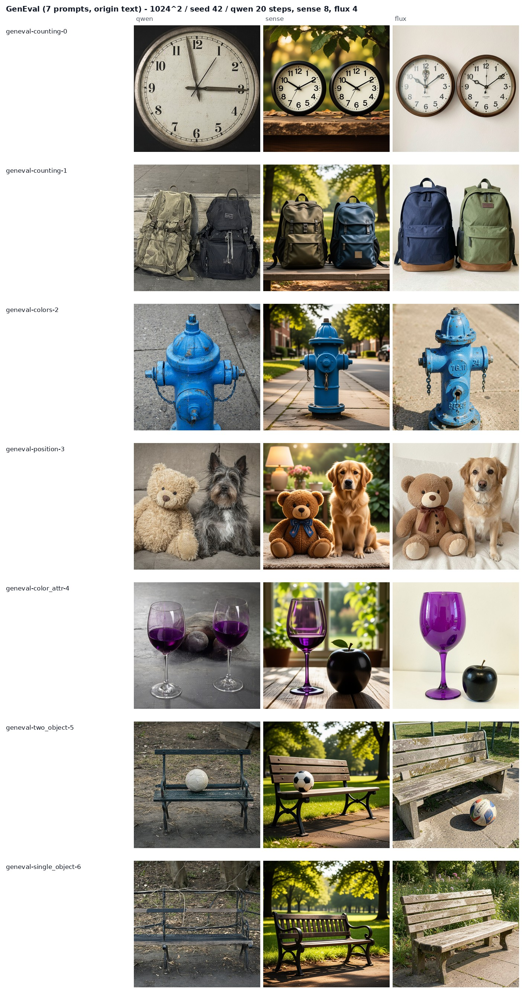
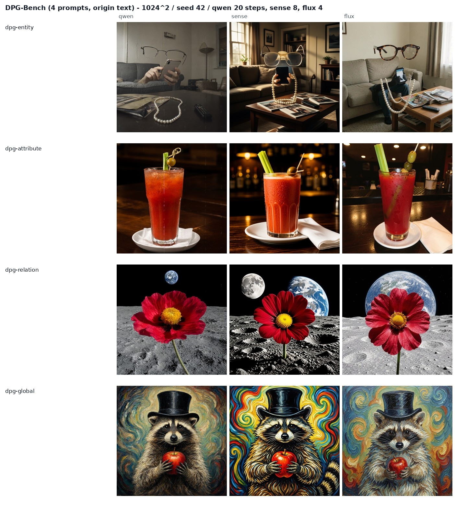
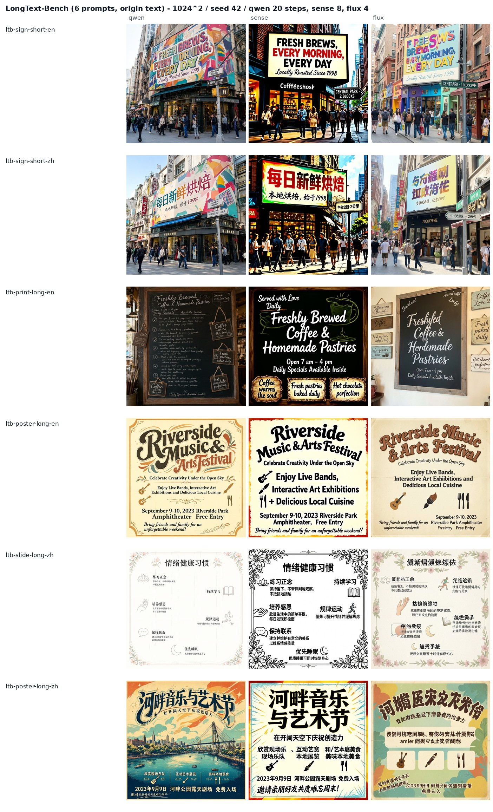
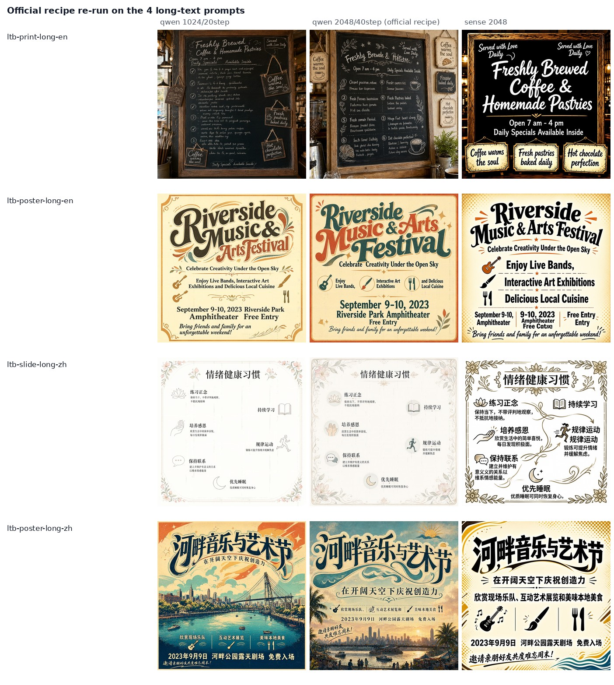
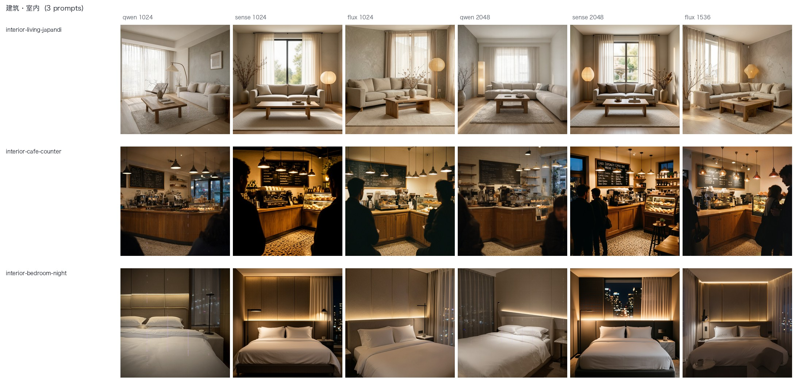
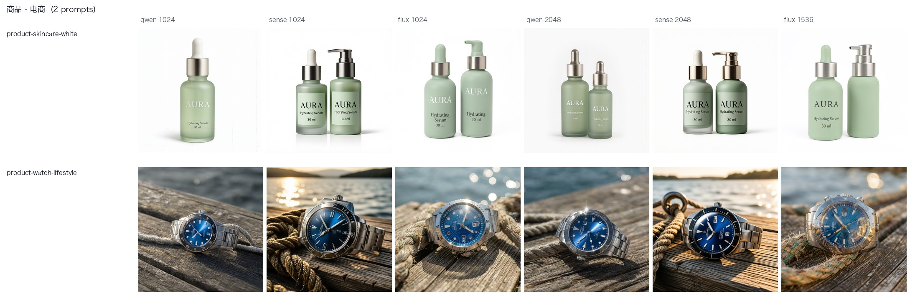
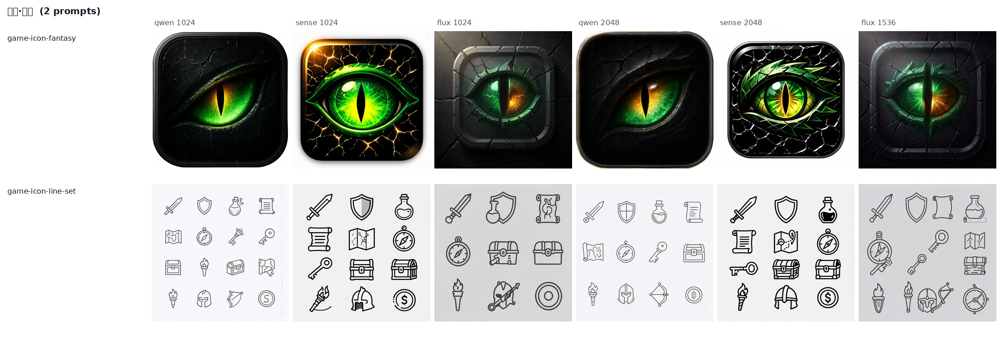
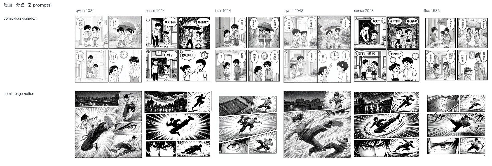
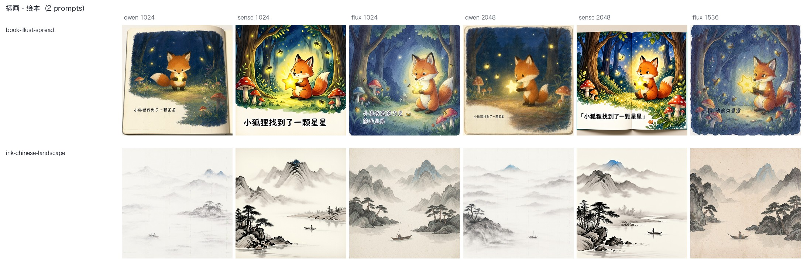

# Qwen-Image-2.1 on public benchmarks — measured, not advertised

A three-way, single-GPU comparison of **Qwen-Image-2.1** against two other image models that were
actually deployable here, run on the **verbatim prompt text** of public benchmarks
(GenEval / DPG-Bench / LongText-Bench), same seed, plus a round-2 **attribution study** of why our
numbers and the official showcase disagree.

> **TL;DR** — the gap is mostly about *evaluation protocol*, not about the model. The official
> pipeline is **prompt-rewriter + 2048²/40 steps + long English descriptions**; round 1 used
> **raw short prompts + 1024²/20 steps**. Same prompt, same resolution, same seed: rewriting
> GenEval's terse prompts into enhancer-style descriptions fixed **2/2** object-dropping failures.

中文主报告见 [`README.md`](README.md)。 HTML report (GitHub Pages): <https://wangsheng1991.github.io/qwen-image-2.1-bench/>

## Headline numbers

| | Qwen-Image-2.1 | SenseNova-U1.5 | FLUX.2-klein-KV |
|---|---|---|---|
| Shape | 7B DiT (visual gen) + Qwen3-VL text encoder, RGBA VAE | 8B+8B MoT, 8 steps + 8-step LoRA | 9B distilled + INT4 KV, 4 steps |
| 1024² per image (median) | 52.1 s (20 steps) | 9.8 s | **1.6 s** |
| 2048² per image | 102–111 s | **13 s** | not supported (≤1536) |
| Text rendering, char accuracy (OCR) | 74.6% | **86.5%** | 40.8% |
| Text rendering, line hits | 25/35 | **26/35** | 4/35 |
| … Chinese long text, line hits | **18/20** | **18/20** | 0/20 |
| … English long text, line hits | 7/15 | **8/15** | 4/15 |
| GenEval compositional (7) | **4/7** | 7/7 | 7/7 |
| DPG-Bench long description (4) | 2 good / 2 flawed | **4 good** | **4 good** |
| Native transparent RGBA | **✅ unique** | ✗ | ✗ |

## Prompt set

Verbatim text in [`prompts.json`](prompts.json); sources:

| Source | Prompts | Where |
|---|---|---|
| GenEval | 7 | <https://github.com/djghosh13/geneval> (`evaluation_metadata.jsonl`) |
| DPG-Bench | 4 | <https://github.com/TencentQQGYLab/ELLA> (`dpg_bench.csv`) |
| LongText-Bench | 6 | <https://huggingface.co/datasets/X-Omni/LongText-Bench> |
| Qwen model card | 1 | Qwen-Image-2.1 README (transparent RGBA) |

### GenEval (original prompt text)



Qwen failed three of seven: `a photo of two clocks` drew one clock; `a photo of a purple wine glass
and a black apple` dropped the apple entirely; `a photo of a bench` collapsed structurally at 1024².
Both baselines scored 7/7.

### DPG-Bench and LongText-Bench





Long text is Qwen's and SenseNova's home turf (FLUX produces garbled Chinese and misspelled English).
Qwen's characteristic failure is **inventing entire blocks of plausible-looking fake words** to fill
dense small text — a chalkboard menu comes out with text that is not one real word.

## Advertised vs measured

The official blog's four selling points are mostly about **editing** (up to 10 reference images,
lasso/brush/mask, portrait and product fidelity) and native transparency; the "small model, big
performance" claim rests on **Qwen-Image-Bench total score 60.28 (rank 7)**, where FLUX 2 Max = 55.33
and FLUX 2 Pro = 54.57 — that 5.7-point gap is where the marketing tone comes from. That leaderboard
**has no GenEval / DPG breakdown**, so it is not commensurable with "4 of 7 prompts passed".

The official README is explicit about the recommended pipeline:

> “For best results, we recommend using the official **prompt rewriting models** to expand short
> prompts into detailed, high-quality descriptions.”

and about defaults: `num_inference_steps=40`, `2048×2048`, `guidance-scale 1`. Round 1 followed none
of them.

### Ablation: only the prompt changes

Same machine, same GPU, 2048², 20 steps, seed 42. Left column is the GenEval original; right column
is an enhancer-style long description (**note: not** the real output of the official 20 GB
Qwen3.5-VL 9B rewriter — that checkpoint was not deployed; this is a hand-written stand-in in the
same style).


- `a photo of two clocks` → still **one clock** at 2048² with the original text; **exactly two** with
  the long description.
- `a photo of a purple wine glass and a black apple` → apple missing with the original text; **both
  objects present with correct colours** with the long description.

**These failures are a prompt-format problem, not a capability problem.** GenEval's prompt style is
designed for automated scorers and happens to be the worst-case input for this model's recommended
pipeline.

### What resolution does and does not fix


The collapsed bench at 1024² is fine at 2048² — *structural* failures are a config problem.

Re-running the four long-text prompts with the official recipe (2048²/40 steps), with SenseNova at
2048² as a control:



| LongText-Bench prompt | Qwen 1024²/20 steps | Qwen 2048²/40 steps (official) | SenseNova 2048² |
|---|---|---|---|
| English chalkboard menu | 20.5% · 2/7 | **13.7% · 3/7** | 63.4% · 3/7 |
| English festival poster | 94.4% · 4/5 | 80.6% · 2/5 | 73.3% · 1/5 |
| Chinese slide | 81.5% · 12/12 | 81.1% · 12/12 | 76.9% · 11/12 |
| Chinese festival poster | 90.2% · 3/5 | **98.6% · 4/5** | 97.3% · 4/5 |
| **mean (char accuracy · line hits)** | **71.7% · 72.4%** | **68.5% · 72.4%** | **77.7% · 65.5%** |

Scoring: RapidOCR reads the generated text and compares it character-by-character against the text
the prompt asked for; char accuracy = 1 − edit distance / reference length, a line counts as a hit at
similarity ≥ 0.85. Caveat: OCR is not fully comparable across resolutions (smaller, more decorative
type at 2K), so the honest reading is **"no measurable gain"**, not "2K is worse". The cost is real
though: 172 s/image at 2048²/40 steps vs 52 s/image at 1024²/20 steps.

### Attribution summary

| Source of the gap | Weight | Evidence |
|---|---|---|
| **Missing the official prompt rewriter; raw short prompts used** | largest | ablation fixes 2/2 (`images/round2/prompt-rewrite.jpg`) |
| **Incommensurable metrics**: vendor composite vs per-prompt pass rate | large | leaderboard is a total with no GenEval/DPG split |
| **Different opponent**: INT4 4-step distill vs full FLUX 2 Pro/Max | medium | FLUX 2 Pro = 54.57 on their board; klein-KV is not on it |
| **Sampling and scoring**: 1 image/prompt, single seed, n=4–7; human yes/no instead of Mask2Former | medium | official GenEval is 553 prompts × 4 images with an object detector |
| **Resolution / steps** | large for structural failures, small for text | bench: broken at 1K, fine at 2K; long-text scores flat |

## Vertical domains (architecture / interior / portrait / app UI / product / game icons / anime / comic / illustration)

Leaderboards measure general capability, which does not answer *"which model should take this job"*.
So we wrote a second set of **26 vertical prompts** — **self-authored, not a public benchmark**, but
each one carries its own checkpoints ([`prompts-vertical.json`](prompts-vertical.json)), across 9 domains.
All three models ran at two sizes: a uniform 1024² (comparable across models) and each model's
recommended size (Qwen / SenseNova 2048², FLUX 1536) — **156 images** in total.

### Verdict by domain

| Domain | Prompts | Recommended | Key finding |
|---|---|---|---|
| Architecture · exterior | 3 | any of the three | All produce commercial-grade mood images. The difference is in detail: **SenseNova 1024 and FLUX 1536 hallucinate large signage on glass curtain walls** (`ARCHITECTURE` / `NEAC`); Qwen does not |
| Architecture · interior | 3 | **SenseNova** | Most stable spatial layering and lighting. Qwen drops mood constraints at 1024²: the night bedroom came out as daylight |
| Portrait | 4 | **SenseNova** (close-ups) / any (group, full-body) | The elderly close-up shows the largest gap: SenseNova's wrinkles, beard hair and capillaries are photographic, Qwen is visibly smoother. In the five-person group all three drew five distinct faces with no broken hands |
| App · UI | 4 | **SenseNova** | The only one that renders a correct Chinese UI already at 1024² (12/12 lines). At 1024² Qwen **shrinks the whole mockup into a small block in the middle with ghosting**, only recovering at 2048² (line hits 5/12 → 11/12, char accuracy 63.0% → 86.4%). FLUX gets all Chinese wrong |
| Product · e-commerce | 2 | any of the three | White-background retouch and lifestyle shots are both shippable. Qwen missed the "two bottles" at 1024², but its label text is the most accurate (100%) |
| Game · icons | 2 | Qwen (single icon) | A single icon is commercial-grade from all three; **the "12 style-consistent line icons" prompt breaks all three** — count, stroke weight and style all drift |
| Anime · 2D | 4 | **Qwen / SenseNova** (FLUX out) | On the TV-anime poster both Qwen and SenseNova write the Chinese main title, subtitle, broadcast slot and studio credit **correctly** (OCR 4/4, 100% chars; Qwen perfect at both sizes); FLUX garbles the whole block (0/4). Character sheets and the two-person rainy-street scene come out fine from all three; **the six-cell chibi sticker sheet passes on all three** (six cells, distinct expressions) — unlike the 12-icon prompt. The differences are cosmetic: SenseNova's tidy 3×2 grid with white die-cut outlines, Qwen's loose spacing, FLUX's drifting character design |
| Comic · storyboard | 2 | **SenseNova** | Four-panel comic: **only SenseNova at 1024² puts each of the four Chinese lines into the correct panel** (100% · 4/4); Qwen writes all four lines (4/4 hits) but **pairs them with the wrong panels** and mixes in garbled characters, so char accuracy is only 34.8%; FLUX garbles everything (0/4). On the black-and-white action page all three produce "5 panels + speed lines + eye close-up"; SenseNova's gutters are the cleanest, Qwen's panels skew and leave white gaps |
| Illustration · picture book | 2 | **SenseNova** (ink) / either (picture book) | Picture-book spread: Qwen scores 100% at both sizes (and adds a convincing open-book perspective), SenseNova is correct too, FLUX garbles it. Chinese ink-wash landscape: SenseNova has the best tonal range and detail; **Qwen comes out too faint at both sizes** — the negative space swallows the mountains |

### Objective scoring of the text-bearing prompts (OCR)

| Prompt | Size | Qwen-Image-2.1 | SenseNova-U1.5 | FLUX.2-klein-KV |
|---|---|---|---|---|
| `ui-mobile-home-zh` (Chinese health-app home) | 1024² | 63.0% · 5/12 | **80.9% · 12/12** | 38.0% · 2/12 |
| | native | **86.4% · 11/12** | 82.6% · 12/12 | 33.0% · 2/12 |
| `ui-login-en` (English login page) | 1024² | 85.3% · 6/6 | **96.8% · 6/6** | 77.9% · 5/6 |
| | native | 96.0% · 5/6 | **99.2% · 6/6** | 83.0% · 6/6 |
| `ui-dashboard-dark` (dark data dashboard) | 1024² | 29.8% · 13/14 | 13.3% · 13/14 | 17.1% · 12/14 |
| | native | 34.1% · 13/14 | 24.4% · 13/14 | 22.2% · 11/14 |
| `ui-appstore-three` (three store screens) | 1024² | **33.3% · 4/4** | 22.4% · 4/4 | 22.4% · 3/4 |
| | native | 23.8% · 4/4 | 18.2% · 3/4 | 14.4% · 3/4 |
| `product-skincare-white` (label on a white bottle) | 1024² | **100% · 3/3** | 66.7% · 3/3 | 72.1% · 3/3 |
| | native | 66.7% · 3/3 | 66.7% · 3/3 | **100% · 3/3** |
| `anime-keyvisual-zh` (anime poster: title / subtitle / slot / studio) | 1024² | **100% · 4/4** | **100% · 4/4** | 57.8% · 0/4 |
| | native | **100% · 4/4** | 98.0% · 4/4 | 55.8% · 0/4 |
| `comic-four-panel-zh` (Chinese dialogue in four panels) | 1024² | 34.8% · 4/4 | **100% · 4/4** | 22.9% · 0/4 |
| | native | 33.3% · 4/4 | 81.1% · 4/4 | 14.6% · 0/4 |
| `book-illust-spread` (one line of body text on a picture-book spread) | 1024² | **100% · 1/1** | **100% · 1/1** | 21.1% · 0/1 |
| | native | **100% · 1/1** | 90.9% · 1/1 | 13.3% · 0/1 |
| **mean (8 text prompts)** | 1024² | 68.3% · 83.3% | 72.5% · **97.9%** | 41.2% · 52.1% |
| | native | 67.5% · 93.8% | 70.1% · **95.8%** | 42.0% · 52.1% |

Same ruler as the public-benchmark round (identical RapidOCR scoring script), with three caveats:

- On the dark dashboard **char accuracy is low for all three (13–34%)**, because the models invent a
  screenful of table data; the **line hit rate (11–13/14) is what reflects "did it write the strings
  we asked for"**. For UI capability, read hit rate, not char accuracy.
- The four-panel comic shows the opposite case and is worth reading together: **Qwen hits 4/4 lines
  while char accuracy is only 34.8%** — it wrote all four lines but attached them to the wrong panels
  and mixed in garbled characters. Low char accuracy means "the characters are wrong", high hit rate
  means "the sentence exists but in the wrong place"; this prompt needs both metrics.
- Text density differs between the two sizes, so do not compare char accuracy across sizes directly.

### Latency (median of the first 18 prompts)

| | Qwen-Image-2.1 | SenseNova-U1.5 | FLUX.2-klein-KV |
|---|---|---|---|
| 1024² median | 53.2 s | 9.8 s | **1.5 s** |
| native median | 113.1 s (2048²) | 13.2 s (2048²) | **3.8 s** (1536²) |

**The 8 prompts added later are not in this table — do not compare them.** While they ran, card 3 was
occupied by a render-farm job, so the Qwen arm moved to a borrowed card and used the more
memory-frugal `sequential` offload mode for all 2048² images and three of the 1024² ones: **97 s at
1024² / 208 s at 2048²**, roughly 2× the `model` mode of round 1. Offload mode only changes when
weights are staged in and out, not the sampling math, so image quality is unaffected at the same seed
(text hits for the new prompts are in line with round 1); the timings are not comparable, hence
excluded. SenseNova (9.9 s / 12.9 s) and FLUX (1.5 s / 3.7 s) share round 1's protocol and are
included in `results/results-vertical-timings.csv` (156 rows, per prompt).

### One contact sheet per domain (3 models × 2 sizes)

Architecture · exterior:


Architecture · interior:



Portrait:


App · UI:


Product · e-commerce:



Game · icons:



Anime · 2D:


Comic · storyboard:



Illustration · picture book:



Single images are in `images/vertical/<size>/<model>/<prompt-id>.jpg`.

### Selection matrix

| Job | Pick | Why |
|---|---|---|
| Architecture render (mood + materials) | **SenseNova** | Most accurate light at dusk / night; but it writes hallucinated signage on glass facades, so eyeball every output |
| Interior render | **SenseNova** | Most stable spatial relations and light layering |
| Portrait close-up (real skin) | **SenseNova** | The high-frequency detail gap is obvious; Qwen is smoother |
| Group / full-body | any of the three | Proportions hold, faces are distinct |
| App / web UI mock (Chinese text) | **SenseNova** | Usable already at 1024², and 5.4× faster than Qwen |
| App / web UI mock (English only) | Qwen @2048², or SenseNova | Qwen's English labels are the cleanest, but at 1024² it shrinks into a block with ghosting |
| Product on white | any of the three | Just state the requirement clearly |
| Single game icon | Qwen | The most three-dimensional form and lighting |
| Icon sets / strictly consistent multi-element | **none** | Degenerates into "each one drawn independently"; needs post-processing or a dedicated model |
| Anime / game key visual with a big Chinese title | **Qwen or SenseNova** | Both nail the Chinese title hierarchy (OCR 4/4); FLUX garbles the whole block — do not use it for Chinese posters |
| Chibi sticker sheet (up to ~6 cells) | **SenseNova** | All three deliver; SenseNova's grid, white outlines and expression spread are the tidiest, Qwen's spacing is loose, FLUX's character design drifts |
| Four-panel comic with Chinese dialogue | **SenseNova** | The only one that puts each line in its own panel; Qwen mismatches panels and adds garbled characters, FLUX is all noise |
| Black-and-white action storyboard page (no text) | any of the three | The difference is gutter discipline: SenseNova > FLUX > Qwen |
| Children's picture-book spread with one line of text | **Qwen or SenseNova** | Both get the text right; Qwen also adds a convincing open-book perspective |
| Chinese ink-wash landscape | **SenseNova** | Best tonal range and detail; Qwen comes out too faint at both sizes |

## Reproduction

Requirements: two OpenAI-shaped image endpoints (`POST /v1/images/generations` with `prompt`,
`width`, `height`, `steps`, `seed`, `response_format`). Paths and endpoints come from environment
variables; no code edits needed.

```bash
pip install pillow rapidocr-onnxruntime
export BENCH_ROOT=$PWD
export QWEN_URL=http://127.0.0.1:8500
export SENSE_URL=http://127.0.0.1:8400

python3 scripts/eval_run.py --size 1024     # round 1, three models, same seed
python3 scripts/eval2k.py                   # re-test the failures at 2048²
python3 scripts/ocr_score.py                # objective OCR scoring for text prompts
python3 scripts/eval_fair.py                # official recipe (2048²/40 steps)
python3 scripts/rewrite_ablation.py         # prompt-only ablation
python3 scripts/pack_deliver.py             # contact sheets + delivery bundle

python3 scripts/vertical_eval.py --size 1024 --models qwen,sense   # vertical set at a uniform 1024²
python3 scripts/vertical_eval.py --size 2048 --models qwen,sense   # vertical set at native size
python3 scripts/ocr_vertical.py                                    # OCR scoring of the text prompts
python3 scripts/pack_vertical.py                                   # nine per-domain contact sheets
```

`pack_vertical.py` labels sheets with Chinese domain names, so point it at a font with CJK glyphs
otherwise the labels render as boxes:
`PACK_FONT=/path/to/NotoSansCJK-Bold.ttc PACK_FONT_INDEX=0 python3 scripts/pack_vertical.py`.

The FLUX arm has to run the pipeline directly (`scripts/flux_eval.py`, needs nunchaku and the INT4 KV
weights, paths via `FLUX_KV_ROOT` / `FLUX_TE_PATH`) because the deployed service only exposes an edit
endpoint:

```bash
python3 scripts/flux_eval.py --prompts prompts-vertical.json --size 1536 --out out_vertical/1536/flux
```

## Limitations — read these with the numbers

- **One image per prompt, single seed.** This is a spot check, not a leaderboard score; at n=4–7 a
  single prompt is ±14%.
- Compositional and long-description prompts were judged **by eye**, not by GenEval's Mask2Former or
  DPG's mPLUG+CLIP scorers.
- The ablation's "long description" is hand-written in the enhancer's style, **not** real output from
  the official rewriter.
- The three models do not run the same step count: each used its own service default (Qwen 20 /
  SenseNova 8 / FLUX 4) — a "best configuration" comparison, not an equal-budget one. Qwen's 40-step
  control is in `results/results-fair.json`.
- The 26 vertical prompts are **written by us**, not a public benchmark; they are a
  "which model for this job" aid, and the same one-image-per-prompt caveat applies.
- Eight of the vertical prompts were **added in a second round**: card 3 was held by a render-farm
  job while they ran, so the Qwen arm used a borrowed card and the more memory-frugal `sequential`
  offload mode (images are fine; timings are not comparable — see the latency note above). The other
  two models share one protocol across both rounds.

## Files

```
index.html                   HTML report served by GitHub Pages (headlines + nine domain sheets)
prompts.json                 public prompt text (18, with source and required rendered strings)
prompts-vertical.json        self-authored vertical prompts (26 across 9 domains, with checkpoints)
results/                     per-run JSON records incl. OCR scores; timings.csv is rebuilt from logs
results/logs/                raw run logs (failures and retries included)
results/logs-vertical/       vertical-set run logs (v-* first round / v2-* added prompts, incl. the wait for a free card)
results/results-vertical-*   vertical set: timings (156 rows) and OCR scores (same ruler as above)
images/compare/              three-way contact sheets (GenEval / DPG / LongText / transparency)
images/round2/               2K re-test, official-recipe re-run, prompt ablation
images/1k-1024/<model>/      round-1 single images (file name = prompt id)
images/vertical/<size>/<model>/  vertical set singles (1024 / 2048 / 1536)
images/vertical/by-domain/   one contact sheet per domain (9), 3 models × 2 sizes
scripts/                     eval, scoring, ablation and packaging scripts
scripts/make_deck.py         builds an editable PPTX from slides/slides.md (no npm / LibreOffice needed)
slides/slides.md             Chinese deck source (12 slides, Slidev: web / PDF / PPTX)
slides/dist/                 the generated editable PPTX (12 slides)
blog/                        field notes (docsify, zero build; live under /blog/)
```

## Sharing

| What | Link |
|---|---|
| HTML report | <https://wangsheng1991.github.io/qwen-image-2.1-bench/> |
| Field notes (blog) | <https://wangsheng1991.github.io/qwen-image-2.1-bench/blog/> |
| Deck (editable PPTX, 12 slides) | [`slides/dist/qwen-image-2.1-deck.pptx`](slides/dist/qwen-image-2.1-deck.pptx) |
| Social preview card (1280×640) | [`images/social-preview-dark.png`](images/social-preview-dark.png) ｜ [light](images/social-preview-light.png) |

Edit `slides/slides.md` and re-run `python scripts/make_deck.py` to refresh the deck. The cards are
generated by [socialify](https://socialify.git.ci) from the repo description (add `&v=N` to bust its cache).

## License

Code MIT; generated images and text CC BY 4.0 — please cite this repository. The evaluated models
belong to their respective owners; all conclusions are specific to this sample.
