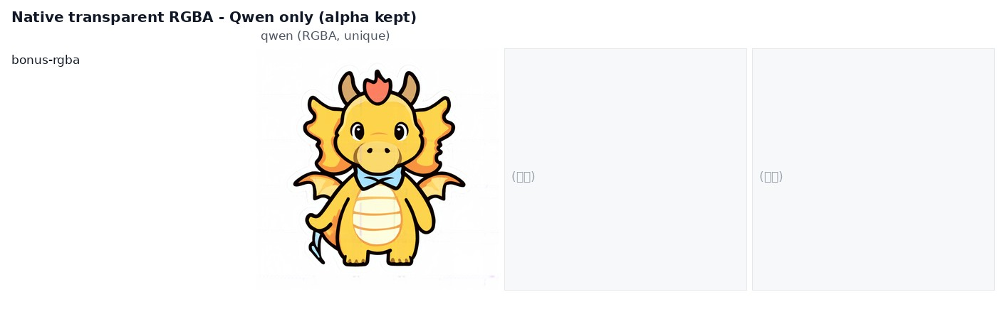

# Qwen-Image-2.1 公开评测集实测

把 **Qwen-Image-2.1** 和另外两个能跑到的图像模型拉到同一台机器、同一张卡、同一份题单上对打：
**题面一字未改**，全部取自公开评测集（GenEval / DPG-Bench / LongText-Bench），同 seed。
另外做了一轮「宣传 vs 实测」的**差距归因**：官方宣传的分数和我们的实测为什么对不上。

> **一句话结论**：差距主要不在模型，在口径。官方推荐管线是「**提示词增强器 + 2K/40 步 + 长英文描述**」，
> 我们首轮用的是「**原始短题面 + 1K/20 步**」——同一道题、同分辨率、同 seed，只把题面改写成官方增强器那种长描述，
> 两道丢物体的失败题**当场都过了**。

English abstract: a 3-way, single-GPU comparison of Qwen-Image-2.1 against SenseNova-U1.5 and a
4-step INT4 FLUX.2-klein deployment, using the *original* prompt text of GenEval / DPG-Bench /
LongText-Bench (18 prompts, 75 images, seed 42), plus an ablation showing that most of the gap to
the official showcase comes from **prompt format**, not resolution: rewriting GenEval's terse
prompts into enhancer-style long descriptions fixed 2/2 object-dropping failures at the same
resolution and seed.

📄 **[English version → README.en.md](README.en.md)**

## 结论速览

| | Qwen-Image-2.1 | SenseNova-U1.5 | FLUX.2-klein-KV |
|---|---|---|---|
| 形态 | 7B DiT（视觉生成部分）+ Qwen3-VL 文本编码器，RGBA VAE | 8B+8B MoT，8 步 + 8-step LoRA | 9B 蒸馏 + INT4 KV，4 步 |
| 1024² 单张（中位） | 52.1 s（20 步） | 9.8 s | **1.6 s** |
| 2048² 单张 | 102–111 s | **13 s** | 不支持（≤1536） |
| 文字渲染 · 字符准确率（OCR） | 74.6% | **86.5%** | 40.8% |
| 文字渲染 · 逐行命中 | 25/35 | **26/35** | 4/35 |
| 其中中文长文本逐行命中 | **18/20** | **18/20** | 0/20 |
| 其中英文长文本逐行命中 | 7/15 | **8/15** | 4/15 |
| GenEval 组合题（7 题） | **4/7** | 7/7 | 7/7 |
| DPG-Bench 长描述（4 题） | 2 好 / 2 有瑕疵 | **4 好** | **4 好** |
| 原生透明 RGBA | **✅ 独有** | ✗ | ✗ |

## 题单与出图

题面原文在 [`prompts.json`](prompts.json)，来源：

| 来源 | 题数 | 地址 |
|---|---|---|
| GenEval | 7（counting×2、colors、position、color_attr、two_object、single_object） | <https://github.com/djghosh13/geneval>（`evaluation_metadata.jsonl`） |
| DPG-Bench | 4（entity / attribute / relation / global） | <https://github.com/TencentQQGYLab/ELLA>（`dpg_bench.csv`） |
| LongText-Bench | 6（英 3 + 中 3：招牌 / 黑板 / 海报 / 幻灯片） | <https://huggingface.co/datasets/X-Omni/LongText-Bench> |
| Qwen 官方模型卡 | 1（原生透明 RGBA） | Qwen-Image-2.1 README |

### GenEval（7 题，原题面）


Qwen 的三次翻车：`a photo of two clocks` 只画一个钟；`a photo of a purple wine glass and a black
apple` 把黑苹果整个丢掉；`a photo of a bench` 在 1024² 下结构崩坏。
另一头两个对手 7/7 全过。

### DPG-Bench（4 题，原题面）


### LongText-Bench（6 题，原题面）


长文本是 Qwen 与 SenseNova 的主场（FLUX 中文整段乱码、英文拼错字）。Qwen 的典型毛病是
**在版面里凭空生成整段假字**：像黑板菜单这种密集小字，它会写出「看起来像英文但一个词都不对」的内容。

### 原生透明 RGBA（Qwen 独有）



## 宣传 vs 实测：差距从哪来

官方博客的卖点里三个是**编辑**（最多 10 张参考图、圈选/涂抹/掩码、人像商品保真）与原生透明，
「小模强效」给的是它自家 **Qwen-Image-Bench 总分 60.28（第 7 名）**——同一张榜上 FLUX 2 Max = 55.33、
FLUX 2 Pro = 54.57，宣传语气的来源就是这个 5.7 分的差。而那张榜**没有 GenEval / DPG 分项**，
和我们「7 题过 4 题」不是同一个量。

官方 README 的 `Prompt Rewriting` 一节写得很直白：

> “For best results, we recommend using the official **prompt rewriting models** to expand short
> prompts into detailed, high-quality descriptions.”

默认推理参数也明写 `num_inference_steps=40`、`2048×2048`、`guidance-scale 1`。**我们首轮一样都没按**。

### 消融：只改题面，其余全不动

同一台机器、同一张卡、2048²、20 步、seed 42。左列是 GenEval 原题面，右列是按官方增强器风格写的长描述
（**注意：不是**官方增强器的真实输出，那个 20 GB 的 Qwen3.5-VL 9B 检查点没有部署，这是人工对齐风格的替身）。


- `a photo of two clocks` → 原题面在 2048² 下**照旧只画一个钟**；长描述 → 正好两个钟。
- `a photo of a purple wine glass and a black apple` → 原题面丢苹果；长描述 → 两个都在，颜色绑定也对。

**结论：这类失败是「短请求不吃」，不是「不会画」。** GenEval 的题面是为自动打分器设计的极简句式，
恰好是官方管线里最不利的输入形态。

### 分辨率/步数修好了什么


「一张长椅」在 1024² 结构崩坏，2048² 正常 —— 这类**结构性失败**确实是配置问题。

把 4 道长文本题按官方配方（2048²/40 步）重跑，并加上 SenseNova 2048² 对照：


| LongText-Bench 原题 | Qwen 1024²/20 步 | Qwen 2048²/40 步（官方配方） | SenseNova 2048² |
|---|---|---|---|
| 英文 · 黑板菜单长文本 | 20.5% · 2/7 | **13.7% · 3/7** | 63.4% · 3/7 |
| 英文 · 音乐节海报 | 94.4% · 4/5 | 80.6% · 2/5 | 73.3% · 1/5 |
| 中文 · 幻灯片长文本 | 81.5% · 12/12 | 81.1% · 12/12 | 76.9% · 11/12 |
| 中文 · 音乐节海报 | 90.2% · 3/5 | **98.6% · 4/5** | 97.3% · 4/5 |
| **平均（字符准确率 · 逐行命中）** | **71.7% · 72.4%** | **68.5% · 72.4%** | **77.7% · 65.5%** |

度量方式：RapidOCR 读出图里的文字，与题目要求文本逐字比对；字符准确率 = 1 − 编辑距离/参考长度，
逐行命中 = 该行相似度 ≥ 0.85。
**注意**：2K 图的字号更小、字体更花，OCR 跨分辨率不完全可比（海报那张 94.4%→80.6% 就是被字体风格吃掉的），
所以这里只能说「**没看到提升**」，不能反过来说 2K 更差。代价倒是实打实：2048²/40 步 **172 s/张** vs 1024²/20 步 52 s/张。

### 归因汇总

| 差距来源 | 贡献 | 证据 |
|---|---|---|
| **缺官方提示词增强器、用原始短题面** | 最大 | 消融 2/2 修复（本仓库 `images/round2/prompt-rewrite.jpg`） |
| **口径不同**：自家复合总分 vs 单点通过率 | 大 | 官方榜是总分且无 GenEval/DPG 分项，60.28 与「7 题过 4 题」量纲不可换算 |
| **对手不同**：INT4 蒸馏 4 步 vs 榜上满血 FLUX | 中 | 榜上 FLUX 2 Pro = 54.57，本仓库对打的 klein-KV 不在榜上 |
| **抽样与打分口径** | 中 | 每题 1 张、单 seed、n=4~7；GenEval 官方是 553 题 × 4 张 + Mask2Former 自动打分，本仓库组合题是人眼判读 |
| **分辨率/步数** | 结构性失败大、文字类小 | 长椅 1K 崩 / 2K 正常；长文本指标 71.7% → 68.5%，没看到提升 |

## 复现

前置：两个 OpenAI 形状的图像接口（`POST /v1/images/generations`，字段 `prompt` / `width` / `height` /
`steps` / `seed` / `response_format`）。路径与端点都走环境变量，不改代码。

```bash
pip install pillow rapidocr-onnxruntime     # rapidocr 只给文字题打分用
export BENCH_ROOT=$PWD                      # 题单 prompts.json 所在目录，也是输出根
export QWEN_URL=http://127.0.0.1:8500       # 被测模型 A
export SENSE_URL=http://127.0.0.1:8400      # 被测模型 B

python3 scripts/eval_run.py --size 1024                  # 首轮：三家同题同 seed，落 out/<model>/
python3 scripts/eval2k.py                                # 翻车题抬到 2048² 复测
python3 scripts/ocr_score.py                             # 文字题 OCR 客观打分
python3 scripts/eval_fair.py                             # 官方配方（2048²/40 步）复跑
python3 scripts/rewrite_ablation.py                      # 只改题面的消融
python3 scripts/pack_deliver.py                          # 出对比大图 + 整理成可直接发人的交付包
```

FLUX 那一臂要直接跑管线（`scripts/flux_eval.py`，需要 nunchaku 与 INT4 KV 权重，路径用
`FLUX_KV_ROOT` / `FLUX_TE_PATH` 指），因为它部署的线上服务只开了编辑接口。

## 已知局限（请连同结论一起看）

- 每题**只出 1 张、单 seed**，是抽样体检不是榜单成绩；n=4~7 时 ±1 题就是 ±14%。
- 组合题与长描述题**由人眼判读**，不是官方 GenEval 的 Mask2Former / DPG 的 mPLUG+CLIP 自动打分。
- 消融臂的「长描述」是人工模仿官方增强器风格写的，**不是**官方增强器（微调 Qwen3.5-VL 9B）的真实输出。
- 三家没跑在完全相同的步数上：各自用服务默认（Qwen 20 / SenseNova 8 / FLUX 4）。这是「各自最佳配置」的口径，
  不是「同预算」的口径；Qwen 的 40 步对照见 `results/results-fair.json`。

## 目录

```
prompts.json                 题面原文（18 题，含公开来源与要求渲染的文字）
results/                     逐次运行的 JSON 记录（含 OCR 打分）；timings.csv 是逐题耗时（从运行日志重建）
results/logs/                原始运行日志（含失败与重试）
images/compare/              三家同题并排大图（GenEval / DPG / LongText / 透明）
images/round2/               2K 复测、官方配方复跑、题面消融
images/1k-1024/<模型>/       首轮单图（文件名 = 题号）
images/2k-retest/  official-recipe/  prompt-rewrite/
scripts/                     评测、打分、消融、打包脚本
```

## License

代码 MIT；评测出图与文档 CC BY 4.0 —— 引用请注明本仓库。
评测对象为第三方模型，商标与模型版权归各自所有者；结论仅代表本次抽样。
