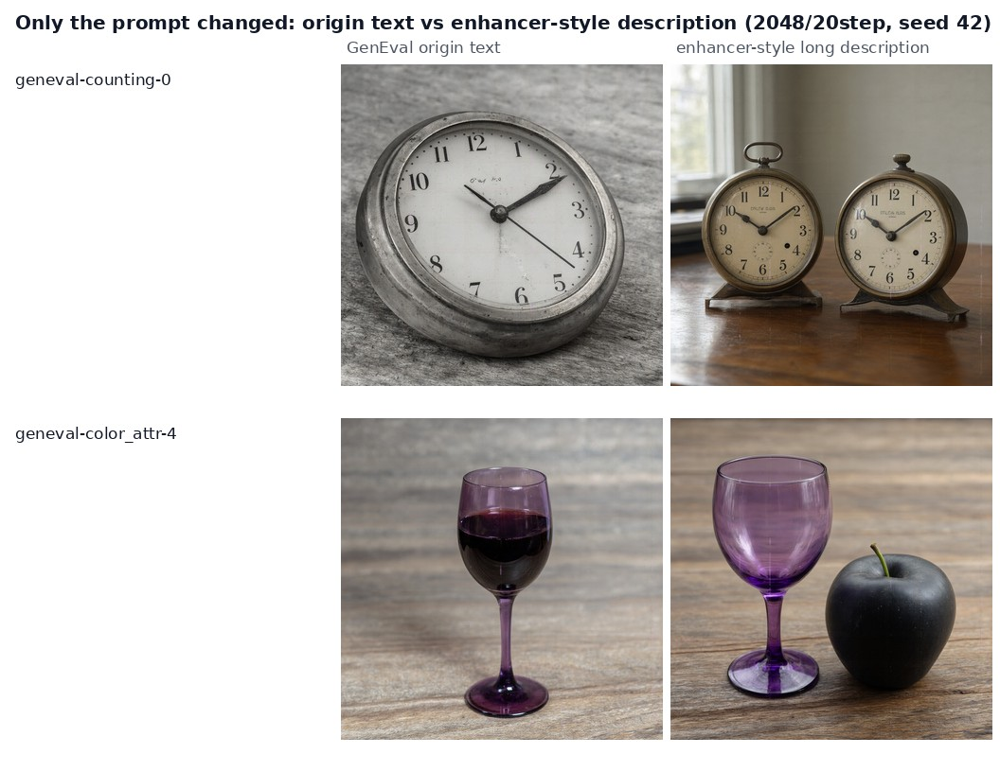
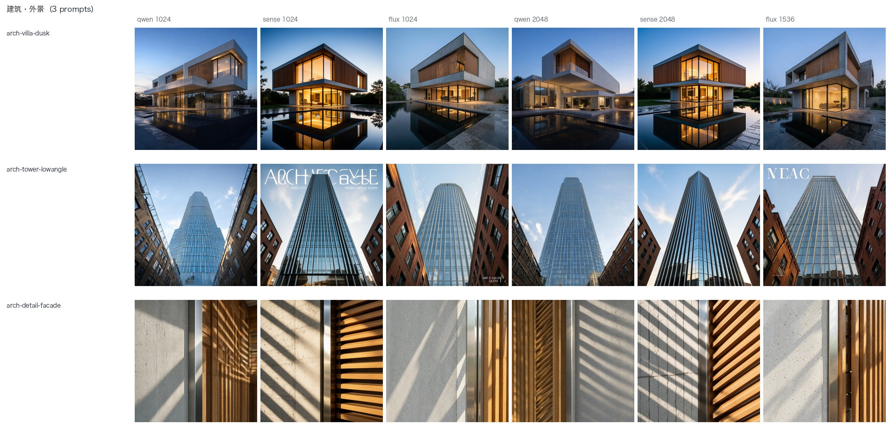
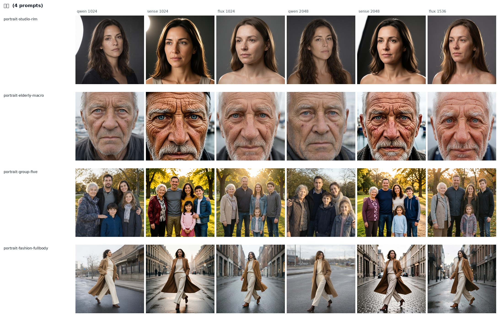
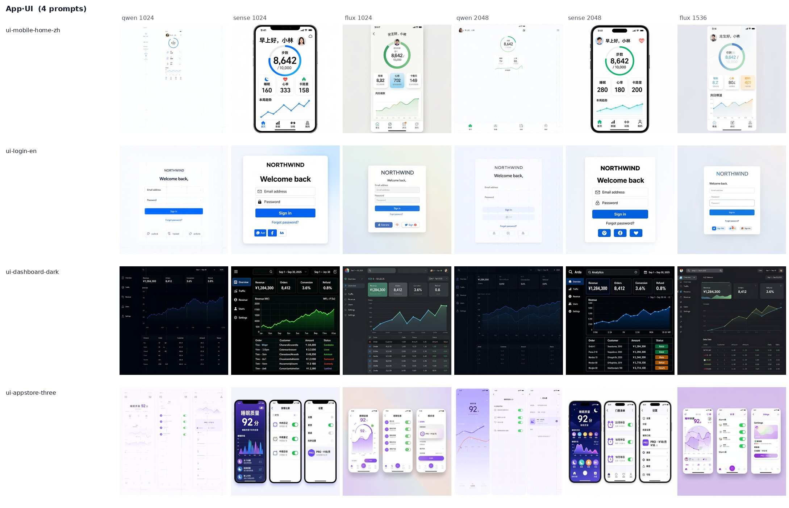
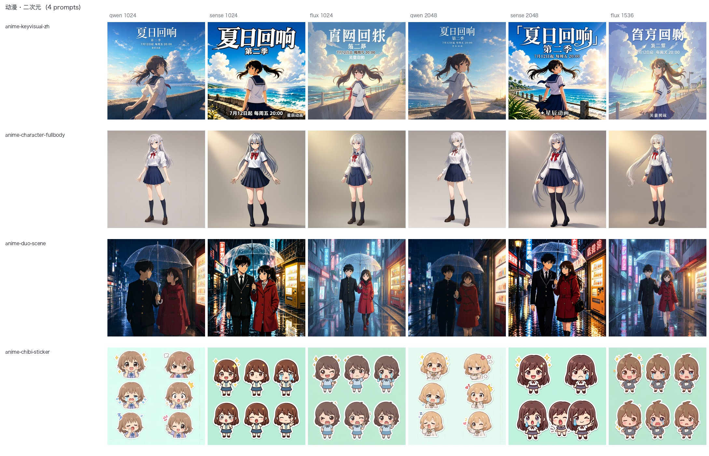

# Qwen-Image-2.1 到底行不行

同机同卡同题面 · 对上 SenseNova-U1.5 与 FLUX.2-klein-KV

公开榜单 18 题 75 张图 + 自建垂直题面 26 题 156 张图 · seed 42 
仓库：github.com/wangsheng1991/qwen-image-2.1-bench

---
layout: center
---

# 一句话结论

公开榜单那轮的差距 **主要是口径问题** —— 官方要的是「提示词增强 + 2K/40 步」，我们首轮一样都没按。 

垂直领域这轮的差距 **主要是分工问题** —— 九个领域**没有通吃的**，各有各的活。

---

# 怎么测的

- **同一台机器、同一张卡、同一份题面**，题面一字未改，同 seed
- 公开榜单：GenEval 7 / DPG-Bench 4 / LongText-Bench 6 / RGBA 1 —— **原题面**
- 自建垂直题面 **26 题 9 领域**，每题写明考点与判定项（`prompts-vertical.json`）
- 两档分辨率：统一 1024²（可横向比）+ 各家推荐档（Qwen / SenseNova 2048²、FLUX 1536）
- 文字题用同一把尺子：RapidOCR 逐字比对 → 字符准确率 + 逐行命中

---

# 公开榜单成绩

| | Qwen-Image-2.1 | SenseNova-U1.5 | FLUX.2-klein-KV |
|---|---|---|---|
| 1024² 单张（中位） | 52.1 s（20 步） | 9.8 s | **1.6 s** |
| 文字渲染 · 字符准确率 | 74.6% | **86.5%** | 40.8% |
| 其中中文长文本逐行命中 | **18/20** | **18/20** | 0/20 |
| GenEval 组合题（7 题） | 4/7 | **7/7** | **7/7** |
| DPG-Bench 长描述（4 题） | 2 好 / 2 有瑕疵 | **4 好** | **4 好** |
| 原生透明 RGBA | **独有** | ✗ | ✗ |

中文长文本两家打平；组合题与长描述是 Qwen 的短板，但要看下一张怎么解释。

---
layout: two-cols-header
---

# 差距从哪来：口径，不是模型

同一台机器、同一张卡、2048²、20 步、seed 42，只把 GenEval 原题面改写成官方增强器风格的长描述：

::left::

::right::

- `a photo of two clocks`：原题面照旧**只画一个钟** → 长描述**正好两个**
- `purple wine glass + black apple`：原题面**丢苹果** → 长描述**两个都在、颜色绑定也对**

这类失败是「短请求不吃」，不是「不会画」。但 2K/40 步没带来文字提升，代价却是 172 s/张。

---

# 垂直领域：九个领域，没有通吃的

| 领域 | 推荐 | 一句话 |
|---|---|---|
| 建筑·外景 | 三家都能用 | SenseNova/FLUX 会往玻璃幕墙上写幻觉招牌 |
| 建筑·室内 | SenseNova | 空间与灯光层次最稳 |
| 人像 | SenseNova（特写） | 老人特写的皮肤细节差距最大 |
| App·UI | SenseNova | 只有它 1024² 就把中文界面写对（命中 97.9%） |
| 商品·电商 | 三家都可用 | 白底图与场景图都能交付 |
| 游戏·图标 | Qwen（单个） | 12 个成套图标三家全崩 |
| 动漫·二次元 | Qwen / SenseNova | 中文海报两家全对，FLUX 乱码 |
| 漫画·分镜 | SenseNova | 只有它把台词放进对应画格 |
| 插画·绘本 | SenseNova | 水墨 Qwen 太淡，绘本两家都行 |

---
layout: two-cols
---

# 房子与人

建筑·外景：三家 × 两档分辨率（左三为 1024 档，右三为 2048/1536 档）

::right::

人像：老人特写的皮肤细节差距最大

---
layout: two-cols
---

# App·UI 与动漫

App·UI：只有 SenseNova 在 1024² 就把中文界面写对

::right::

动漫·二次元：中文海报 Qwen / SenseNova 都对，FLUX 乱码

---

# 掉坑点：Qwen 的四种失败模式

- **1024² 的 UI 稿会缩成小块**并留幽灵重影（2048² 才恢复，命中 5/12 → 11/12）
- **四格漫画台词串格**：四句都写出来了（命中 4/4），但配到错的画格、还夹乱码（字符 34.8%）
- **国风水墨两档都太淡**：留白过头，山体几乎看不见
- **成套多元素（12 个线性图标）崩**：数量、线宽、风格都不统一

反过来，Qwen 也有两项独占优势：原生透明 RGBA、中文海报标题排版满分。

---

# 选型矩阵（照这个挑）

| 场景 | 推荐 |
|---|---|
| 建筑 / 室内效果图 | SenseNova |
| 人像特写（真实皮肤） | SenseNova |
| App / 网页 UI 稿（含中文） | SenseNova（1024² 就可用且快 5.4×） |
| 番剧 / 游戏海报（中文大标题） | Qwen 或 SenseNova |
| 四格漫画（中文对白） | SenseNova |
| 商品白底图 / 合影 | 三家都行 |
| 游戏单图标 | Qwen |
| 成套图标 / 严格一致多元素 | **都不行** |

---

# 口径与局限（请连着结论一起看）

- 每题**只出 1 张、单 seed**，是抽样体检，不是榜单成绩
- 组合题与长描述题**由人眼判读**，不是官方 Mask2Former / mPLUG+CLIP 自动打分
- 消融臂的「长描述」是人工模仿增强器风格写的，**不是**官方增强器输出
- 三家步数不同（Qwen 20 / SenseNova 8 / FLUX 4）：「各自最佳配置」口径
- 新增 8 道垂直题里 Qwen 那臂借卡跑、用了更省显存的 offload 档：**出图正常，耗时不可比**

---
layout: center
class: text-center
---

# 全部数据与复现

报告与 231 张出图：https://github.com/wangsheng1991/qwen-image-2.1-bench

网页版：https://wangsheng1991.github.io/qwen-image-2.1-bench/

题面 `prompts*.json` ｜ 逐题耗时 `results/*.csv` ｜ OCR `results/*ocr*.json` ｜ 脚本 `scripts/`

